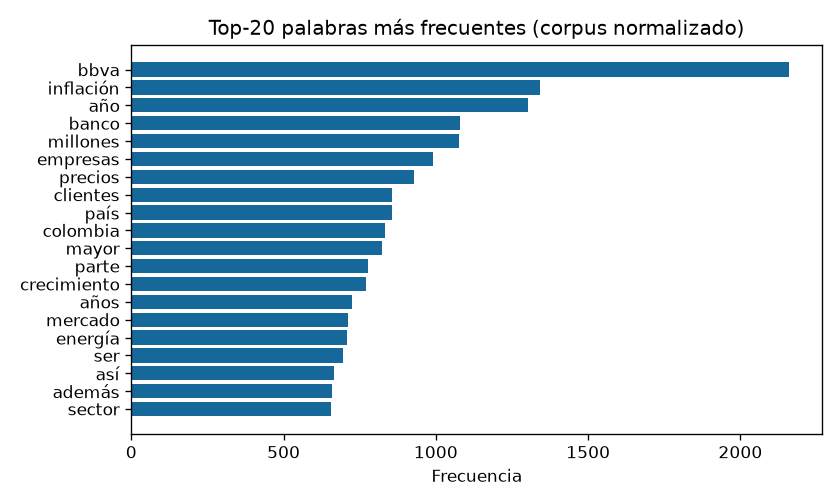
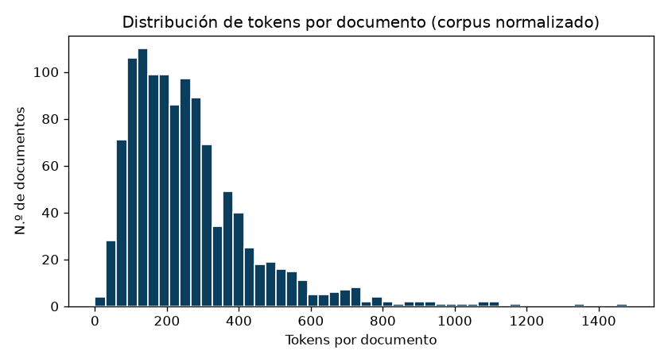
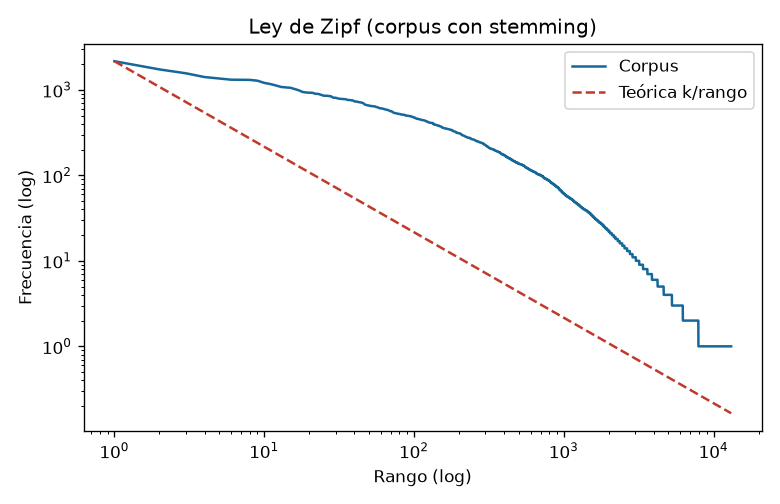
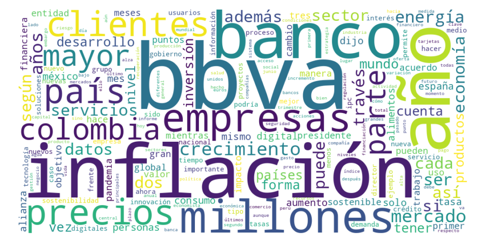

# Laboratorio #1 — Análisis Exploratorio del corpus *Spanish News Classification*

Natural Language Processing  · Universidad Francisco Marroquín 
Milton Beltrán · Agosto 2026

Este reporte presenta el **Análisis Exploratorio de Datos (EDA)** del corpus *Spanish
News Classification* (1217 noticias en español, 7 categorías temáticas), junto con los
**hallazgos** más relevantes y la **justificación de las decisiones** de preparación.
El código completo (carga, exploración, pipeline de normalización y las preguntas de
investigación y análisis) se encuentra en el notebook `lab1.ipynb` del repositorio
enlazado al final. Como paso previo se eliminaron **75 filas exactamente duplicadas**
(el corpus de trabajo queda en **1142 documentos**), ya que inflaban artificialmente las
frecuencias y la distribución por categoría.

---

## EDA del corpus

### 1. Reducción del vocabulario: tokens y tipos, antes vs. después

Se aplicó el pipeline de normalización  (tokenización → minúsculas →
eliminación de puntuación → eliminación de *stopwords* → *stemming*), contando después de
cada paso el total de **tokens** (ocurrencias) y de **tipos** (palabras distintas):

| Paso | Tokens | Tipos | Δ Tipos |
|------|-------:|------:|--------:|
| i. Tokenización        | 632,745 | 38,947 | — |
| ii. Minúsculas         | 632,745 | 36,099 | −7.3 % |
| iii. Quitar puntuación | 579,676 | 27,315 | −24.3 % |
| iv. Quitar *stopwords* | 299,799 | 27,104 | −0.8 % |
| v. *Stemming*          | 299,799 | 13,103 | −51.6 % |

El vocabulario se redujo de **38,947 a 13,103 tipos (−66.4 %)** entre la tokenización y
el final del pipeline. El análisis por paso revela un contraste importante:

- La **eliminación de *stopwords*** es el paso que **más reduce los tokens** (−48.3 %),
  porque las palabras funcionales (`de`, `la`, `que`, `el`) son las más repetidas del
  corpus; en cambio, casi no afecta el vocabulario (−0.8 %).
- El ***stemming*** es el paso que **más reduce los tipos** (−51.6 %), al colapsar
  familias de palabras en una raíz común (`sostenible`/`sostenibilidad` → `sosten…`),
  sin alterar el número de ocurrencias.

**Decisiones y su justificación.** (i) La puntuación se eliminó con `token.isalpha()`,
lo que descarta signos —incluidos los de apertura `¿ ¡`— y conserva tildes y `ñ`; como
costo, también descarta números, aceptable para un vocabulario más limpio. (ii) Como
NLTK no ofrece lematización para español, se usó `SnowballStemmer`, que es **stemming**
(recorte de sufijos) y **no lematización** real: produce raíces que no son palabras de
diccionario (`banc`, `pod`). Para el EDA visual se conservaron **dos versiones** del
corpus: una legible sin *stemming* (para la nube y el top-20) y otra con *stemming*
(para los conteos y la Ley de Zipf).

### 2. Riqueza léxica (razón tipo/token)

La razón **tipo/token (TTR)** mide la diversidad léxica: cuántas palabras distintas hay
por cada ocurrencia. Sobre el corpus normalizado legible (sin *stemming*) la TTR global
es **0.090** (27,104 tipos / 299,799 tokens); con *stemming* baja a **0.044**, coherente
con el colapso de familias de palabras. Por categoría (corpus legible):

| Categoría | Documentos | Tokens | Tipos | TTR |
|-----------|-----------:|-------:|------:|----:|
| Reputacion     |  26 |  7,197 |  2,976 | **0.414** |
| Regulaciones   | 142 | 35,109 |  8,815 | 0.251 |
| Alianzas       | 247 | 46,122 | 10,523 | 0.228 |
| Otra           | 130 | 25,803 |  5,576 | 0.216 |
| Sostenibilidad | 125 | 51,341 | 10,333 | 0.201 |
| Innovacion     | 152 | 49,185 |  8,931 | 0.182 |
| Macroeconomia  | 320 | 85,042 | 11,320 | **0.133** |

Se observa una relación **inversa entre el tamaño de la categoría y su TTR**: Reputación
(la más pequeña, 26 docs) tiene la mayor diversidad (0.414), mientras que Macroeconomía
(la más grande, 320 docs) la menor (0.133). Es el comportamiento esperado, ya que a mayor
volumen de texto las palabras se repiten más y la proporción de tipos nuevos disminuye
(por eso la TTR no debe compararse entre corpus de tamaños muy distintos sin normalizar).

### 3. Palabras más frecuentes (top-20)

Domina de forma notable **`bbva`** (2,160 ocurrencias), seguida de vocabulario económico
(`inflación`, `banco`, `millones`, `precios`, `crecimiento`, `mercado`). Esto revela un
**sesgo de fuente**: el corpus proviene en gran medida de noticias financieras ligadas a
BBVA, lo cual condiciona todo el análisis léxico.

### 4. Distribución de tokens por documento

La longitud de los documentos (corpus normalizado) va de **0 a 1,479 tokens**, con
**media 262.5** y **mediana 226**. La distribución está **sesgada a la derecha** (cola
larga de noticias muy extensas). El mínimo de **0 tokens** es un hallazgo relevante:
algún documento quedó vacío tras la normalización (compuesto solo por *stopwords*,
puntuación o números).

### 5. Ley de Zipf

La curva del corpus (azul) sigue la tendencia decreciente característica de la **Ley de
Zipf**, aproximándose a la recta teórica *f(rango) ≈ k/rango* (roja). El ajuste es bueno
en el rango medio, pero se desvía en los **extremos**: en los rangos altos las palabras
más frecuentes aparecen algo por debajo de lo que predice la curva ideal, y en la **cola**
hay un escalón por las miles de palabras que aparecen una sola vez (*hapax legomena*).

### 6. Comparación por categoría

Top-10 de palabras (corpus legible) en tres categorías:

| # | Macroeconomia | Sostenibilidad | Innovacion |
|---|---------------|----------------|------------|
| 1 | inflación | bbva | bbva |
| 2 | precios | energía | clientes |
| 3 | año | sostenible | datos |
| 4 | bbva | agua | banco |
| 5 | crecimiento | sostenibilidad | empresas |
| 6 | mayor | además | digital |
| 7 | alimentos | millones | través |
| 8 | aumento | puede | innovación |
| 9 | tasa | cambio | tecnología |
| 10 | economía | cada | españa |

Las diferencias son claras y coherentes con cada temática: **Macroeconomía** gira en
torno a indicadores (`inflación`, `precios`, `tasa`, `crecimiento`); **Sostenibilidad**
al medio ambiente (`energía`, `agua`, `sostenible`, `cambio`); e **Innovación** a lo
digital (`datos`, `digital`, `tecnología`, `innovación`). La palabra `bbva` aparece en
todas, confirmando el sesgo de fuente transversal al corpus.

### 7. Nube de palabras

La nube (vocabulario normalizado legible) resume visualmente lo anterior: `bbva` y el
léxico económico-financiero concentran la mayor presencia.

---

## Hallazgos y retos del español

- **Sesgo de fuente:** `bbva` es la palabra más frecuente por amplio margen; el corpus
  está dominado por noticias financieras ligadas a esa entidad.
- **Diversidad léxica y tamaño:** la TTR es inversamente proporcional al tamaño de la
  categoría, por lo que no es comparable directamente entre categorías de distinto volumen.
- **Duplicados desiguales:** los 75 duplicados eliminados no estaban repartidos de forma
  uniforme (p. ej., *Innovación* pasó de 195 a 152 documentos), lo que habría distorsionado
  la comparación entre categorías de no haberse limpiado.
- **Documentos vacíos:** al menos un documento quedó con 0 tokens tras la normalización,
  señal de que un preprocesamiento agresivo puede vaciar textos cortos.
- **Retos propios del español:**
  - El *stemming* con Snowball **elimina las tildes** (`andrés`→`andres`,
    `aseguró`→`asegur`) y genera **raíces que no son palabras reales** (`banc`, `pod`),
    a diferencia de una lematización verdadera.
  - La lista de *stopwords* de NLTK incluye la **negación `no`**; eliminarla puede
    **invertir el significado** de una noticia (p. ej., "el banco **no** aprobó el
    crédito" pierde la negación), un riesgo relevante para tareas de sentimiento.
  - Los signos de apertura `¿ ¡` y los clíticos son particularidades que obligan a
    tokenizar y normalizar con criterio específico para el idioma.

---

## Repositorio

Código, notebook y este reporte: 
https://github.com/MrCifristo/lab1-nlp
