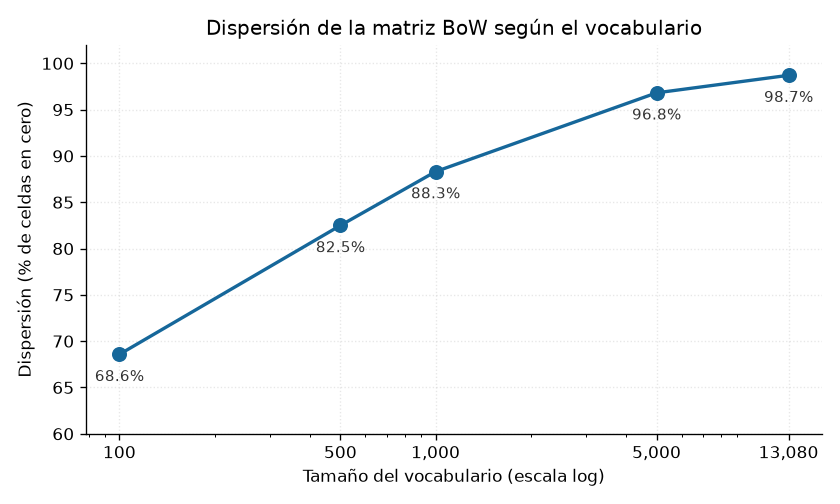

# Laboratorio #2 — Representaciones básicas de texto

Natural Language Processing · Milton Beltrán

Este laboratorio continúa el anterior sobre el corpus **Spanish News Classification**. Se
construyen tres representaciones vectoriales del mismo texto —bolsa de palabras, n-gramas y
TF-IDF— y se comparan documentos con similitud coseno. El código completo está en `lab2.ipynb`.

<strong>Corpus de trabajo:</strong> 1,140 documentos · 7 categorías ·
299,799 tokens · 13,103 tipos

Se parte de los 1,217 documentos originales. Se descartan las 75 filas duplicadas del Lab #1 y
**dos documentos cuyo texto es un único espacio**, un hallazgo nuevo: no son valores nulos, así que
pasaron el chequeo anterior, pero al normalizarlos quedan como filas de puros ceros. El pipeline de
normalización produce cifras idénticas a las del Lab #1, lo que confirma que se reprodujo sin
desviaciones.

## 1. Bolsa de palabras

La matriz documento-término resultante mide **1,140 × 13,080**.

Ese vocabulario tiene 23 entradas menos que los 13,103 tipos del corpus, y la diferencia no viene
de la normalización: `token_pattern` exige por defecto tokens de al menos dos caracteres, así que
descarta letras sueltas y el símbolo `π`. Son 218 ocurrencias de 299,799, el 0.07% del corpus, de
modo que se mantuvo el valor por defecto. La matriz se validó contra un conteo independiente hecho
con `Counter` de NLTK: la suma cuadra y no hay discrepancias por columna ni por fila.

**Qué se pierde**

- **El orden.** `"banco demanda empresa"` y `"empresa demanda banco"` producen vectores idénticos.
  En noticias económicas eso importa: quién adquiere a quién y quién sanciona a quién son
  relaciones con dirección.
- **La gramática**, incluida la negación. "No cumplió la meta" queda a un solo conteo de distancia
  de su contrario.
- **El contexto.** Las expresiones de varias palabras se rompen y los términos con doble
  significado colapsan en una sola columna.

**Qué se gana**

- **Un espacio vectorial.** Cada documento pasa a ser un punto de 13,080 coordenadas, las mismas
  tenga 80 o 3,000 palabras.
- **Operaciones de álgebra lineal** sobre texto, que es lo que permite medir distancias y entrenar
  clasificadores.
- **Interpretabilidad.** Cada dimensión es una palabra concreta, así que el resultado se puede
  auditar.

## 2. Dispersión de la matriz

**El 98.71% de las celdas son ceros**: de 14,911,200 posiciones, solo 192,895 están ocupadas.

| `max_features` | Vocabulario | No-ceros | Dispersión | Cobertura |
|---|---|---|---|---|
| 100 | 100 | 35,825 | 68.57% | 25.2% |
| 500 | 500 | 99,805 | 82.49% | 58.3% |
| 1,000 | 1,000 | 133,312 | 88.31% | 74.0% |
| 5,000 | 5,000 | 181,752 | 96.81% | 95.9% |
| completo | 13,080 | 192,895 | 98.71% | 100.0% |

La dispersión crece porque el vocabulario y el contenido no avanzan al mismo ritmo. Cada término
nuevo añade una columna entera de 1,140 celdas, pero las palabras que se incorporan son cada vez
más raras y llenan cada vez menos: pasar de 5,000 a 13,080 términos multiplica las columnas por 2.6
y solo añade un 6% de celdas ocupadas.

La causa está en la distribución del vocabulario. **El 45.9% de los términos aparece en un solo
documento** y el 65.3% en tres o menos, mientras que un documento usa en promedio 169 palabras
distintas, el 1.29% de las columnas. La cobertura matiza el resultado: con 1,000 términos, el 7.6%
del vocabulario, ya se retiene el 74% de las ocurrencias, así que recortar resulta viable cuando el
costo importa.

**Costo de almacenamiento.** En formato denso la matriz ocuparía 119.3 MB; en CSR ocupa 2.32 MB, un
factor de **51×**. El ahorro también es de cómputo, porque las operaciones dispersas recorren solo
los valores almacenados y su costo depende de `nnz`, no de filas × columnas.

**Matrices dispersas y CSR.** Una matriz dispersa es aquella donde la mayoría de elementos son cero
y conviene guardar solo los no nulos junto con su posición. CSR lo hace con tres arreglos: `data`
con los valores no cero, `indices` con la columna de cada uno e `indptr` con el inicio de cada fila.
Se usa porque la memoria pasa a depender del contenido real y porque el acceso por documento es
inmediato.

## 3. N-gramas

| Configuración | `ngram_range` | Vocabulario | vs. unigramas | Dispersión |
|---|---|---|---|---|
| Unigramas | `(1, 1)` | 13,080 | 1.0× | 98.706% |
| Bigramas | `(2, 2)` | 198,880 | 15.2× | 99.876% |
| Trigramas | `(3, 3)` | 271,910 | 20.8× | 99.905% |
| Uni + bi | `(1, 2)` | 211,960 | 16.2× | 99.804% |
| Uni + bi + tri | `(1, 3)` | 483,870 | 37.0× | 99.861% |

**Los 15 bigramas más frecuentes**, sobre el corpus con *stemming*: `banc central` (212),
`bbva research` (186), `tas interes` (183), `cad vez` (183), `cambi climat` (150), `amer latin`
(146), `millon eur` (140), `punt basic` (139), `bbva mexic` (132), `polit monetari` (129),
`pued ser` (129), `preci consumidor` (128), `año pas` (125), `indic preci` (116), `ultim años`
(106).

Once de los quince aportan algo que los unigramas no capturan: el vocabulario técnico de banca
central (`banc central`, `polit monetari`, `tas interes`, `punt basic`), los fragmentos del índice
de precios (`preci consumidor`, `indic preci`) y las entidades de dos palabras (`bbva research`,
`amer latin`). El caso más claro es `cambi climat`: la raíz `cambi` es de las más ambiguas del
corpus, porque aparece en cambio de divisas, de directiva y climático, y solo el bigrama separa el
tema de sostenibilidad de los otros dos.

Los cuatro restantes son ruido. `cad vez`, `pued ser`, `año pas` y `ultim años` son muletillas
periodísticas repartidas por igual entre todas las categorías, y sobreviven porque el filtro de
stopwords opera palabra por palabra y no sobre pares.

Un efecto del orden del pipeline merece mención: los n-gramas se construyen sobre el texto ya sin
stopwords, así que unen palabras que en el original no eran contiguas. `tas interes` viene de "tasa
**de** interés". Aquí compacta conceptos, pero deja de ser cierto que un bigrama represente
adyacencia real.

**El costo.** Los n-gramas recuperan parte del contexto local que la bolsa de palabras descarta,
pero lo cobran caro, y no solo en tamaño:

| | Vocabulario | Aparece 1 sola vez |
|---|---|---|
| Unigramas | 13,080 | 5,189 (39.7%) |
| Bigramas | 198,880 | 159,228 (**80.1%**) |
| Trigramas | 271,910 | 255,114 (**93.8%**) |

Una columna que se activa en un único documento no sirve para generalizar, solo para memorizar. En
un clasificador es material directo de sobreajuste. La poda resuelve buena parte del problema: con
`min_df=2`, el vocabulario de bigramas cae de 198,880 a **35,803 términos**, un recorte del 82% que
elimina exactamente esos pares.

## 4. TF-IDF

La matriz TF-IDF tiene la misma forma que la de BoW: no cambia qué se representa, sino cuánto pesa
cada término. Cada fila queda normalizada a norma L2 igual a 1 y el IDF va de 1.621 a 7.347. Se
comprobó que `idf_` reproduce la fórmula suavizada de scikit-learn, `ln((1+n)/(1+df))+1`.

Se analizaron tres documentos, el de longitud más cercana a la mediana de cada categoría:

| Categoría | Doc | Términos con mayor TF-IDF | Coincidencias con el top-10 por conteo |
|---|---|---|---|
| Macroeconomía | 1010 | reapertura, IPC, Powell, presiones | 6 de 10 |
| Sostenibilidad | 81 | desperdicio, kilómetros, greta, thunberg | 4 de 10 |
| Innovación | 134 | artificial, factory, ai, sintéticos | 7 de 10 |

Las palabras que TF-IDF pone arriba identifican de qué trata ese artículo en concreto, no lo que lo
hace parecerse a los demás. El puntaje es el producto de los dos factores, así que solo sube si
ambas condiciones se cumplen: `reapertura` aparece 3 veces y encabeza el ranking gracias a un IDF de
5.55, mientras que `aumento` aparece 7 veces y queda cuarta con un IDF de 1.97. Como efecto
secundario emergen los nombres propios, que el conteo simple nunca muestra.

Los rankings coinciden a medias, y el grado de coincidencia resulta informativo: mide cuán
especializado es el vocabulario del documento. Innovación coincide en 7 de 10 porque sus palabras
más repetidas ya son raras en el corpus; Sostenibilidad solo en 4, porque se apoya en vocabulario
común. Estos son los términos que el conteo corona y el IDF expulsa:

| Documento | Término | Veces en el doc | IDF | Documentos en que aparece |
|---|---|---|---|---|
| Macroeconomía | `economía` | 3 | 1.70 | 565 de 1,140 |
| Sostenibilidad | `sostenible` | 4 | 2.54 | 243 |
| Innovación | `bbva` | **8** | 1.86 | 484 |

`bbva` resume el mecanismo completo: es la palabra más frecuente del documento de Innovación y aun
así no entra al top-10 por TF-IDF, porque aparece en el 42% del corpus y no lo distingue de ningún
otro. `sostenible` es igual de revelador, al quedar fuera del top-10 del documento de
Sostenibilidad: dentro de un corpus de noticias de sostenibilidad, esa palabra no informa.

**Por qué penaliza lo común.** El `df` está en el denominador, así que cuantos más documentos
contienen un término menor es su peso, y el logaritmo evita que la penalización sea brutal. Es la
idea detrás de las stopwords, pero continua y aprendida del corpus en lugar de fijada en una lista:
por eso `bbva`, `economía` y `empresa` acaban funcionando como stopwords de facto, algo que ninguna
lista genérica del español podría anticipar.

## 5. Similitud entre documentos

Sobre los vectores TF-IDF se calcularon 649,230 pares, con una similitud media de 0.0571.

Como referencia se tomó el documento 1010, la nota sobre el IPC estadounidense. **Sus cinco vecinos
más cercanos son los cinco de Macroeconomía**, con similitudes de 0.87, 0.49, 0.49, 0.49 y 0.45, y
todos tratan del mismo indicador de precios: el agrupamiento acierta la categoría y también el
subtema. El primero, con 0.87, es prácticamente la misma noticia reescrita; en el corpus hay 14
pares por encima de 0.8, casi duplicados que `drop_duplicates()` no atrapó por no ser idénticos
carácter por carácter.

| Similitud media | Valor |
|---|---|
| Entre documentos de la misma categoría | **0.0914** |
| Entre documentos de distinta categoría | **0.0494** |
| Razón | **1.85×** |

| Categoría | Docs | Intra | Inter | Razón |
|---|---|---|---|---|
| Reputación | 26 | 0.1408 | 0.0516 | 2.73× |
| Macroeconomía | 319 | 0.1196 | 0.0487 | 2.46× |
| Innovación | 152 | 0.0969 | 0.0530 | 1.83× |
| Sostenibilidad | 124 | 0.0899 | 0.0509 | 1.77× |
| Otra | 130 | 0.0950 | 0.0574 | 1.66× |
| Regulaciones | 142 | 0.0696 | 0.0477 | 1.46× |
| Alianzas | 247 | 0.0482 | 0.0430 | **1.12×** |

El vecino más cercano comparte categoría en el **75.3%** de los documentos.

**Por qué coseno y no distancia euclidiana.** La euclidiana mide magnitud y el coseno mide
dirección, y en texto la magnitud del vector es esencialmente la longitud del documento. Dos notas
sobre el mismo tema, una de 200 palabras y otra de 2,000, apuntan en la misma dirección con
longitudes muy distintas, y la euclidiana las declararía lejanas solo por eso. El coseno compara las
proporciones de vocabulario y devuelve un valor acotado entre 0 y 1.

## 6. Análisis

### ¿Cómo cambia la dispersión al pasar a bigramas o trigramas?

**Sube de 98.71% a 99.88% y 99.91% respectivamente.** El vocabulario crece mucho más rápido que el
contenido: se multiplica por 15.2 y por 20.8, mientras que las celdas ocupadas aumentan apenas 46%
y 52%. Cada documento sigue teniendo el mismo texto y lo único que crece es el número de columnas
vacías, en su mayoría inservibles.

### ¿Qué representación es más adecuada para clasificar por categoría?

**TF-IDF.** La bolsa de palabras deja que dominen los términos más frecuentes, que aquí son `bbva`,
`economía` y `empresa`: aparecen en más del 40% de los documentos y no discriminan nada, así que un
clasificador entrenado sobre conteos crudos gasta capacidad en ruido. Los n-gramas puros son la peor
opción, con 15 veces más vocabulario y un 80% de columnas que aparecen una sola vez, aunque sí
funcionarían como complemento con `ngram_range=(1,2)`, `min_df=2` y ponderación TF-IDF.

### ¿La similitud coseno agrupa por categoría? ¿Cuáles se confunden?

**Agrupa, pero con una señal débil:** 1.85× de razón y 75.3% de acierto del vecino más cercano.

**Alianzas es la que más se confunde**, con una razón de 1.12×: su similitud interna es casi
idéntica a la que tiene con el resto del corpus, así que en la práctica no forma grupo. "Alianza" no
es un tema sino un tipo de evento, dos empresas que se asocian, y eso ocurre igual en banca, en
tecnología o en sostenibilidad; sus documentos comparten la estructura de la noticia, no el
vocabulario, y estas representaciones solo ven vocabulario. Le siguen Regulaciones (1.46×) y "Otra",
un cajón heterogéneo por definición. En el extremo opuesto, Macroeconomía llega a 2.46× porque su
vocabulario técnico es muy repetitivo.

### ¿Qué representación usaría para un buscador de noticias similares?

**TF-IDF con similitud coseno**, lo construido en la sección 5: los cinco vecinos del documento de
referencia no solo comparten categoría, comparten subtema. El IDF hace que el parecido lo decidan
los términos distintivos, la normalización L2 permite comparar notas de longitudes muy diferentes y
el formato disperso mantiene la búsqueda barata, porque el producto punto solo recorre los términos
compartidos.

Antes de producción haría dos ajustes: `ngram_range=(1,2)` con `min_df=2`, para capturar conceptos
como "cambio climático" sin la explosión de vocabulario, y un filtro por encima de 0.8, que en este
corpus son casi duplicados.

---

<strong>Repositorio:</strong> <a href="https://github.com/MrCifristo/NaturalLanguageProcessing">github.com/MrCifristo/NaturalLanguageProcessing</a> · Notebook: <code>lab2-nlp/lab2.ipynb</code>

