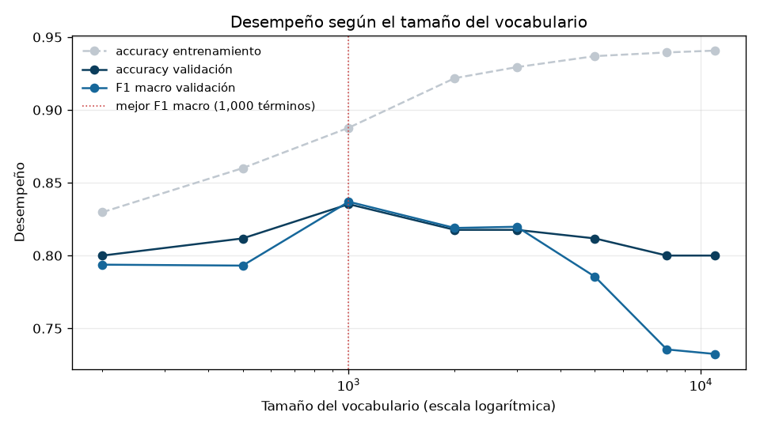
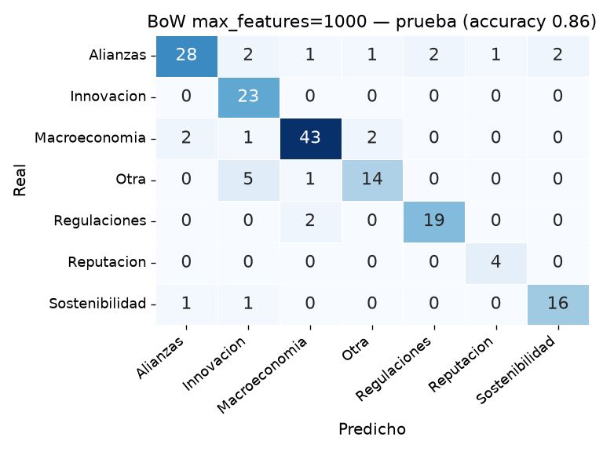

# Laboratorio #3 — Clasificación de texto con Naive Bayes

Natural Language Processing · Milton Beltrán

Este laboratorio entrena un clasificador Naive Bayes Multinomial sobre el corpus **Spanish News
Classification**, usando las representaciones construidas en el Lab #2. Se comparan bolsa de
palabras y TF-IDF, se analizan los errores, se mide el efecto de la representación y se
implementa el algoritmo desde cero. El código completo está en `lab3.ipynb`.

<strong>Corpus de trabajo:</strong> 1,134 documentos · 7 categorías ·
298,753 tokens · 13,093 tipos · particiones 793 / 170 / 171

Al corpus del Lab #2 (1,140 documentos) se le quitaron **6 filas más**: tres pares de noticias con
el mismo texto y la misma URL, pero etiquetadas con categorías distintas. En el Lab #2 eran
irrelevantes porque no había etiquetas; aquí harían daño por dos vías, fuga de información si una
copia cae en entrenamiento y la otra en prueba, y un techo imposible, porque ninguna predicción
puede acertar dos etiquetas contradictorias. Sin criterio objetivo para elegir la correcta, se
eliminan ambas copias.

## 1. Conjuntos de entrenamiento, validación y prueba

La división se hizo con `train_test_split` en dos pasos —primero 70/30, después ese 30% por
mitades— con `stratify` en ambos llamados y `random_state` fijo. Se partieron los **índices** del
DataFrame, no las columnas sueltas, para poder recuperar el texto original de cualquier documento
mal clasificado en el análisis de errores.

| Categoría | Entrenamiento | Validación | Prueba |
|---|---|---|---|
| Macroeconomia | 223 (28.1%) | 48 (28.2%) | 48 (28.1%) |
| Alianzas | 171 (21.6%) | 36 (21.2%) | 37 (21.6%) |
| Innovacion | 106 (13.4%) | 23 (13.5%) | 23 (13.5%) |
| Regulaciones | 99 (12.5%) | 21 (12.4%) | 21 (12.3%) |
| Otra | 89 (11.2%) | 19 (11.2%) | 20 (11.7%) |
| Sostenibilidad | 87 (11.0%) | 19 (11.2%) | 18 (10.5%) |
| Reputacion | 18 (2.3%) | 4 (2.4%) | 4 (2.3%) |

La estratificación funcionó: la desviación máxima entre las proporciones de una misma categoría en
los tres conjuntos es de **0.65 puntos porcentuales** y ninguna categoría desaparece de ningún
conjunto. El corpus está desbalanceado 12:1, así que **Reputacion entrena con 18 documentos y se
evalúa con 4**: cualquier métrica suya se mueve en saltos de 25 puntos.

**Para qué sirve cada conjunto.** Entrenamiento es lo único que el modelo puede mirar: de ahí salen
sus probabilidades y el vocabulario de los vectorizadores. Validación es el banco de pruebas del
desarrollo, para comparar alternativas y quedarse con la mejor. Prueba es la medición final y se
toca una sola vez. No se decide mirando prueba porque, en cuanto un resultado de prueba cambia lo
que uno hace, ese conjunto deja de ser datos no vistos: la información se filtra al modelo a través
de nuestras decisiones y la cifra deja de medir generalización.

## 2. Los dos clasificadores

Ambos vectorizadores se ajustaron **solo con entrenamiento** (`fit_transform` en train, `transform`
en validación y prueba). En TF-IDF la restricción es doble, porque el `fit` aprende el vocabulario y
además los IDF: calcularlos sobre el corpus completo metería en el peso de cada palabra información
sobre en cuántos documentos de prueba aparece.

El costo de no hacer trampa está medido: el vocabulario ajustado con entrenamiento tiene **10,968
términos** contra los 13,070 del corpus completo, y en validación el **3.18%** de las ocurrencias
(1,460 de 45,918) queda fuera de vocabulario y el modelo no las ve.

**P(c)** es qué tan común es cada categoría antes de leer nada: 223/793 = 0.281 para Macroeconomia,
18/793 = 0.023 para Reputacion. **P(wᵢ|c)** es la proporción que ocupa una palabra entre todas las
de esa categoría, con suavizado de Laplace para que ninguna quede en cero. Para clasificar, el
modelo calcula `log P(c) + Σ nᵢ·log P(wᵢ|c)` y toma el score más alto; como P(c) entra una vez y las
palabras cientos, en documentos largos manda la evidencia léxica. Las verosimilitudes son
interpretables: `inflacion` es 29 veces más probable en Macroeconomia que en la siguiente categoría
y `reput` 44 veces más en Reputacion, mientras `banc` apenas supera por 1.5× a su segunda porque el
corpus entero habla de bancos.

## 3. Evaluación

| Representación | Conjunto | Accuracy | F1 macro | F1 ponderado |
|---|---|---|---|---|
| BoW | entrenamiento | 0.941 | 0.936 | 0.941 |
| **BoW** | **validación** | **0.800** | **0.732** | **0.795** |
| TF-IDF | entrenamiento | 0.710 | 0.548 | 0.663 |
| TF-IDF | validación | 0.547 | 0.360 | 0.474 |

**Sobreajuste.** En BoW la brecha entrenamiento→validación es de 14.1 puntos, explicable con 10,968
features contra 793 documentos: muchas palabras se ven una o dos veces y sirven para memorizar. Aun
así generaliza, porque 0.80 sobre datos nuevos no es la caída libre de la pura memorización. TF-IDF
cae 16.3 puntos, pero su problema no es sobreajuste: falla **también en entrenamiento** (0.710), y
un modelo que no aprende ni los datos que vio no tiene un problema de generalización.

**BoW gana por 25 puntos de accuracy.** Lo revelador es cómo falla TF-IDF: de 170 documentos de
validación predice **109 veces Macroeconomia** —que solo tiene 48 reales— y nunca predice
Reputacion. Su precision alta en varias clases es un espejismo: las predice tan poco que casi no se
equivoca, con recall entre 0.05 y 0.16.

La causa se midió comparando los dos términos del score:

| | Suma por documento | Evidencia entre clases | Prior | Proporción |
|---|---|---|---|---|
| BoW | 261.5 | 242.09 | 2.52 | **96.2×** |
| TF-IDF | 9.91 | 4.76 | 2.52 | **1.9×** |

TF-IDF normaliza cada documento a norma L2 = 1, así que en vez de aportar ~261 conteos aporta 9.9
de peso total y la evidencia léxica queda apenas al doble del prior. Con esa proporción, el prior de
Macroeconomia decide en cuanto el texto no es inequívoco. **TF-IDF pondera mejor cada palabra pero
destruye la magnitud de los conteos, que es justo lo que `MultinomialNB` necesita**: la mejor
representación del Lab #2 es la peor para este clasificador.

## 4. Análisis de errores

De los 34 errores de BoW en validación, **7 son entre Alianzas y Regulaciones** (4 + 3), el par con
más confusión mutua. Revisando esos documentos aparecen tres causas distintas:

- **El tema arrastra.** El doc 667, sobre el aniversario de Uber Taxi —nacido de una alianza con
  TaxExpress— se va a Regulaciones por `uber` (×7), `taxistas` y `taxi`: en entrenamiento Uber
  aparece casi siempre en el conflicto legal con los taxis. La palabra `alianza`, presente una sola
  vez, no compensa. Igual el doc 72, con `taxistas`, `multas` e `ilegal`.
- **La etiqueta original es discutible.** Los docs 589 y 296 son columnas de opinión sobre
  elecciones etiquetadas como Alianzas; el modelo predice Regulaciones por `elecciones`, `pueblo`,
  `decreto` y `subsidios`. Es defendible que tenga más razón que la anotación.
- **Gana la palabra literal.** El doc 756 (convenio MinCiencias–CRC, etiquetado Regulaciones) se va
  a Alianzas por `alianza` y `convenio`.

**Las palabras más probables por categoría** tienen sentido donde el modelo acierta: Macroeconomia
(`inflación`, `precios`, `tasa`, `crecimiento`) y Sostenibilidad (`energía`, `sostenible`,
`electricidad`, `agua`). El problema está en el par confundido: **Alianzas y Regulaciones comparten
9 de sus 20 palabras más probables** (`colombia`, `empresas`, `mercado`, `país`, `servicios`…) y
cada una tiene una sola palabra realmente propia. Si la noticia no dice literalmente "alianza" o
"regulación", decide vocabulario que no distingue nada.

**El supuesto de independencia** se ve en la confianza: el modelo se equivoca con **100% de certeza
en 5 de los 7 errores cruzados**. En el doc 667, `uber`, `taxi`, `taxistas` y `tarifas` son la misma
señal, pero se suman como evidencia independiente hasta volver la decisión inapelable. También se
pierde el contexto: en "la alianza entre Uber y TaxExpress", `alianza` gobierna a `uber`, pero para
el modelo son dos palabras sueltas en la misma bolsa.

## 5. Efecto de la representación

| Representación | Vocabulario | Acc. train | Acc. val | F1 macro | Entrenar |
|---|---|---|---|---|---|
| BoW completo | 10,968 | 0.941 | 0.800 | 0.732 | 1.9 ms |
| **BoW max_features=1000** | 1,000 | 0.888 | **0.835** | **0.837** | 1.3 ms |
| BoW max_features=5000 | 5,000 | 0.937 | 0.812 | 0.786 | 1.6 ms |
| BoW uni+bigramas | 156,417 | 0.989 | 0.759 | 0.680 | 9.7 ms |
| BoW uni+bi, max_features=5000 | 5,000 | 0.940 | 0.824 | 0.798 | 1.8 ms |
| TF-IDF completo | 10,968 | 0.710 | 0.547 | 0.360 | 1.9 ms |
| BoW completo (implementación propia) | 10,968 | 0.941 | 0.800 | 0.732 | 1.2 ms |
| BoW max_features=1000 (propia) | 1,000 | 0.888 | 0.835 | 0.837 | 0.7 ms |

**Recortar el vocabulario mejora el modelo.** Con las 1000 palabras más frecuentes la accuracy sube
de 0.800 a 0.835 y el F1 macro de 0.732 a 0.837. La curva muestra el caso de libro: la accuracy de
entrenamiento crece de forma monótona hasta 0.941 mientras la de validación hace pico en 1000
términos y luego cae. La brecha entrenamiento–validación baja de 14.1 a 5.3 puntos. Las palabras más
allá de las primeras mil son tan raras que no generalizan y solo sirven para memorizar.

La mejora se concentra en las categorías pequeñas: **Reputacion pasa de F1 0.40 a 0.89**, Innovacion
sube 9 puntos y Otra 7, mientras Macroeconomia —la más grande— es la única que baja (2 puntos). Con
18 documentos de entrenamiento, las estimaciones de Reputacion sobre palabras raras eran ruido. Por
eso el F1 macro sube 10 puntos y la accuracy solo 3.5.

**Los bigramas cuestan mucho y no compensan.** `ngram_range=(1,2)` lleva el vocabulario a 156,417
términos (14×), la vectorización de 0.08 a 0.28 s y el entrenamiento 5×, y el desempeño **empeora**
(0.759). Concuerda con el Lab #2, donde el 80% de los bigramas aparecía una sola vez: no
generalizan, solo permiten memorizar (accuracy de entrenamiento 0.989). Podados a 5000, en cambio,
uni+bi (0.824 / 0.798) supera a los 5000 unigramas (0.812 / 0.786) porque sobreviven los bigramas
con significado, pero ninguna configuración con bigramas le gana a las 1000 palabras sueltas: en
este corpus el mejor modelo es el más simple.

## 6. Implementación propia

El clasificador se reescribió desde cero con numpy: log-priors por conteo de documentos, log P(w|c)
con suavizado de Laplace, predicción por `argmax` de log-prior más el producto de la matriz de
conteos por las log-verosimilitudes. **Reproduce `MultinomialNB` exactamente**: diferencia máxima
de 0.00 en log P(w|c), de 6.7e-16 en log P(c) —ruido de punto flotante— y **100% de predicciones
idénticas** en validación, con y sin recorte de vocabulario.

Lo más difícil fue el suavizado, y no por el numerador sino por el denominador: si se suma α a cada
una de las 10,968 palabras, el total de la categoría crece en α·|V| y no en α, así que dividir entre
el total original deja "probabilidades" que no suman 1. Lo más sorprendente fue comprobar que sin
logaritmos el producto de verosimilitudes de un documento de 479 palabras da **exactamente 0.0**, no
un número pequeño: las siete categorías empatarían en cero. Y lo que no era evidente usando
scikit-learn es que entrenar Naive Bayes es literalmente contar —no hay iteraciones ni
optimización—: el modelo entero son dos tablas y entrena en menos de 2 ms, mientras vectorizar con
bigramas tarda 290. El costo está en la representación, no en el clasificador.

## 7. Evaluación final y análisis

| Modelo | Accuracy (val) | Accuracy (prueba) | F1 macro (val) | F1 macro (prueba) |
|---|---|---|---|---|
| **BoW max_features=1000 (elegido)** | 0.8353 | **0.8596** | 0.8370 | **0.8578** |
| BoW completo | 0.8000 | 0.8246 | 0.7324 | 0.7599 |
| TF-IDF completo | 0.5471 | 0.5731 | 0.3602 | 0.3939 |

El modelo elegido logra **0.86 de accuracy y 0.858 de F1 macro** sobre 171 documentos nunca usados.
Es incluso mejor que en validación —señal de que no se ajustó el modelo a ese conjunto— y el orden
entre los tres modelos se conserva.

**1. ¿Por qué Naive Bayes es probabilístico y no basado en distancias?** Porque no mide parecido
entre documentos, sino qué tan probable es que una categoría haya producido ese texto: evalúa siete
hipótesis con probabilidades estimadas de todo el entrenamiento junto, sin compararse contra ningún
documento concreto. La ventaja es que resume cada categoría en una tabla —no hay que guardar ni
recorrer los 793 documentos—, incorpora la frecuencia de las clases, que el coseno ignora, y entrega
un ranking completo. Las limitaciones: necesita etiquetas, asume independencia entre palabras y no
normaliza por longitud, algo que el coseno sí hace bien.

**2. ¿Por qué funciona si el supuesto es falso?** Porque lo que decide es el orden de los scores, no
su valor: aunque el modelo cuente varias veces la misma señal, la exagera para todas las categorías
a la vez y el ranking se mantiene. Además cada palabra aporta una señal débil y son cientos las que
se suman, así que los errores se compensan; y con una matriz 98% vacía, estimar dependencias entre
pares de palabras sería imposible, mientras contar palabra por palabra sí funciona con 793
documentos. Lo que sí se rompe son las probabilidades: sirve el orden, no el número.

**3. ¿Qué fue lo más difícil de implementar?** El denominador del suavizado (sección 6), y entender
que sin logaritmos el algoritmo no da un resultado impreciso sino cero.

**4. ¿Qué categorías fueron más fáciles y cuáles más difíciles?** En prueba, Macroeconomia (0.91),
Regulaciones (0.90), Reputacion y Sostenibilidad (0.89); las peores, Otra (0.76) y Alianzas (0.82).
Coincide parcialmente con el Lab #2: Macroeconomia era la más cohesionada por similitud coseno
(2.46×) y es la mejor clasificada, y **Alianzas era la peor (1.12×) y sigue entre las peores**,
porque "alianza" es un tipo de evento y no un tema. **No coincide en Reputacion**, la más
cohesionada del Lab #2 (2.73×) y aquí la peor con vocabulario completo (F1 0.40): su dificultad no
viene del léxico sino de tener 18 documentos, y por eso el recorte la lleva a 0.89.

**5. ¿En qué momento usé cada conjunto?** Validación en todo el desarrollo —comparar BoW contra
TF-IDF, analizar errores, elegir el vocabulario, decidir sobre bigramas, verificar la implementación
propia— y prueba una sola vez, al final. No mezclarlos importa porque validación se gasta al usarla:
tras comparar seis configuraciones sobre los mismos 170 documentos, el mejor resultado ya incluye
suerte. El 0.86 de prueba es limpio porque no se decidió nada con él.

**6. ¿Qué riesgos tendría en producción?** Que **siempre responde algo**: ante una categoría nueva
elegiría una de las siete, quizá con 100% de confianza; lo mitigaría con un umbral sobre el margen
entre el primer y el segundo score, mandando lo dudoso a revisión manual. Que **el vocabulario
envejece**: ya el 3.18% de las palabras de validación quedaba fuera, y con empresas y tecnologías
nuevas esa proporción crece; se mitiga reentrenando y vigilando esa tasa. Que **las clases están
desbalanceadas**: Reputacion tiene 26 documentos en todo el corpus. Y que **las etiquetas tienen
ruido**, como mostraron las noticias contradictorias: un modelo no puede ser más consistente que
sus datos.

---

<strong>Repositorio:</strong> <a href="https://github.com/MrCifristo/NaturalLanguageProcessing">github.com/MrCifristo/NaturalLanguageProcessing</a> · Notebook: <code>lab3-nlp/lab3.ipynb</code>

