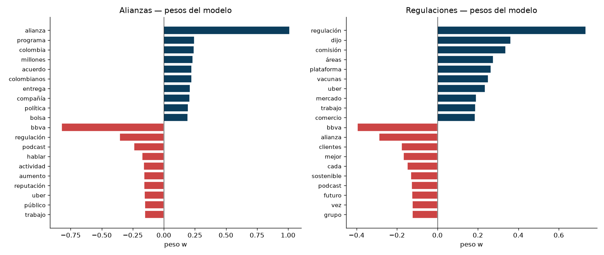
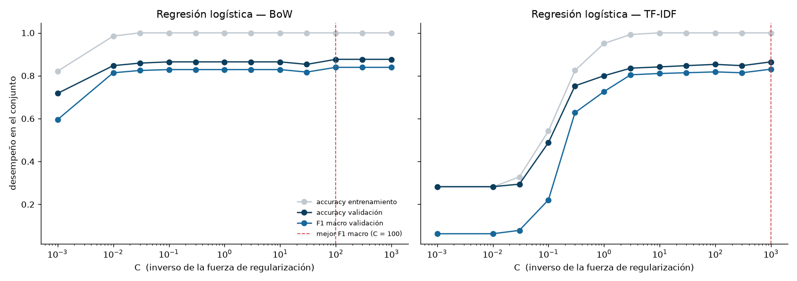

# Laboratorio #4 — Modelos lineales: regresión logística

Natural Language Processing · Milton Beltrán

Este laboratorio entrena un clasificador de **regresión logística** sobre el corpus **Spanish News
Classification**, con las dos representaciones del Lab #2, y lo compara contra el Naive Bayes del
Lab #3. El código completo está en `lab4.ipynb`.

<strong>Corpus de trabajo:</strong> 1,134 documentos · 7 categorías ·
particiones 793 / 170 / 171 · vocabulario de 10,968 términos ajustado solo con entrenamiento

El enunciado exige reutilizar **exactamente** las particiones y los vectorizadores del Lab #3. Como
el notebook es autocontenido se reconstruyen, así que cinco `assert` lo comprueban; el más fuerte
verifica que Naive Bayes reproduzca sus cifras exactas de aquel laboratorio (0.8000 y 0.5471 en
validación). Los cinco pasan.

**Numeración.** El PDF llega a la sección 6, pero los entregables piden el "efecto de la
regularización" —que no aparece— y remiten al análisis como "sección 7", mientras ese análisis llama
"sección 6" al de errores que el PDF numera 5. Falta una sección, igual que en el Lab #3: se adopta
la numeración corrida con la regularización como Sección 5.

## 1. Construcción del clasificador

`z = w·x + b` es el puntaje de una categoría: `x` es el documento vectorizado (10,968 números, casi
todos cero), `w` los pesos aprendidos para esa categoría y `b` su sesgo. **`z` no tiene escala** —en
la celda 1.3 va de −4.2 a 7.3— y por eso hace falta la **sigmoide**, que lo aplasta al intervalo
(0, 1) de forma creciente, con σ(0) = 0.5 como indiferencia. Como no altera el orden, la categoría de
mayor `z` sigue siendo la de mayor probabilidad.

Con siete categorías el modelo aprende **siete** vectores de pesos: `coef_` es (7, 10968) y la
sigmoide se generaliza a **softmax**, `P(c|x) = exp(z_c) / Σ exp(z_k)`, que obliga a que las siete
probabilidades sumen 1, o sea que las categorías compiten entre sí. La predicción es el `argmax`.

El ajuste por tener más de dos categorías **no es un parámetro**: `multi_class="multinomial"` está
deprecado desde scikit-learn 1.5, y con `'auto'`, siete clases y `lbfgs` el modelo **ya usa softmax
multinomial**. Conviene comprobarlo, porque `coef_.shape` no lo distingue de one-vs-rest: rehaciendo
el cálculo a mano, softmax manual `== predict_proba` da **True** y la sigmoide normalizada da
**False**. Ambos convergen dentro del `max_iter` por defecto, pero **BoW necesita 55 iteraciones y
TF-IDF 33**.

## 2. Evaluación

| Representación | Conjunto | Accuracy | F1 macro | F1 ponderado |
|---|---|---|---|---|
| **BoW** | entrenamiento | **1.0000** | 1.0000 | 1.0000 |
| **BoW** | **validación** | **0.8647** | **0.8286** | **0.8633** |
| TF-IDF | entrenamiento | 0.9508 | 0.9043 | 0.9486 |
| TF-IDF | validación | 0.8000 | 0.7263 | 0.7893 |

**Overfitting.** En BoW es del libro: **accuracy 1.0000 en entrenamiento**, el modelo no se aproxima
a los datos, los reproduce sin un error — con 10,968 features para 793 documentos las siete
categorías son linealmente separables. Las brechas, 13.5 y 15.1 puntos, son parecidas a las del
Lab #3 (14.1 y 16.3), pero memorizar no impidió generalizar: 0.8647 supera al mejor modelo de aquel
laboratorio (0.8353). **La brecha mide cuánto se memorizó, no cuánto se fracasa.**

**Gana BoW por 6.5 puntos**, mismo orden que el Lab #3 pero con la distancia desplomada: allí TF-IDF
perdía por 25.3. La regresión logística **rescata a TF-IDF**: con `MultinomialNB` caía a 0.5471 y
predecía Macroeconomia 109 veces de 170 sin predecir Reputacion ni una; con la misma matriz sube a
0.8000 y predice Macroeconomia 49 veces cuando hay 48 reales. La razón es estructural: Naive Bayes
*suma* un prior estimado por separado a una evidencia cuya magnitud depende de la representación,
mientras que aquí `b` y `w` se aprenden conjuntamente y el sesgo no puede dominar por un accidente de
escala.

**¿Por qué sigue ganando BoW?** TF-IDF hace dos cosas a la vez, así que evaluamos una representación
intermedia: BoW crudo da 0.8647, **BoW normalizado a L2 sin IDF** 0.8235 y TF-IDF 0.8000, o sea que
**normalizar cuesta 4.1 puntos y el IDF otros 2.4**. El mecanismo es de **escala frente a
regularización**: en BoW un documento va de 27 a 1,011 conteos (37×) y en TF-IDF todos valen 1, así
que al achicar las features se achican los puntajes (|z| medio de 7.77 a 1.89) mientras `l2` sigue
con la misma fuerza porque `C = 1.0` en ambos. **TF-IDF no está peor representado: está más
regularizado.** Su ventaja escondida es la **calibración**: BoW se declara seguro por encima del 99 %
en **77 de 170** documentos y sus puntajes correlacionan **+0.66 con el largo del documento**, así
que su "seguridad" mide en parte cuántas palabras tenía la noticia; en TF-IDF, 0 de 170 y +0.08.

## 3. Interpretación de pesos

Los pesos positivos de **Macroeconomia** son el vocabulario del tema (`inflación` +0.47, `aumento`,
`economía`, `precios`, `ipc`) y los negativos, el vocabulario **de las otras categorías** (`personas`,
`digital`, `usuarios`, `alianza`, `regulación`): el modelo aprendió también a qué **no** se parece una
noticia macroeconómica. En el par confundido la simetría es exacta — `alianza` pesa **+1.01** en
Alianzas y −0.29 en Regulaciones; `regulación`, **+0.73** y −0.36. Cada categoría empuja hacia abajo
la palabra insignia de su rival.

Frente a las palabras de mayor `P(wᵢ|c)` de Naive Bayes **coinciden en parte, y el grado depende de
si la categoría tiene vocabulario propio**: Macroeconomia 7 de 15, Regulaciones 4, Alianzas solo 3.
Encaja con el Lab #2, donde Alianzas resultó la **menos cohesionada** del corpus (intra/inter 1.12×)
porque "alianza" es un tipo de evento y no un tema.

La diferencia de fondo es qué clase de palabra premia cada método. Sobre las 7 × 15 = 105 posiciones
del top de cada categoría, en Naive Bayes hay 64 términos distintos y solo el **64 %** es exclusivo
de una categoría (`empresas` está en el top-15 de **cinco**); en regresión logística hay 100 y el
**97 %** pertenece a una sola. Naive Bayes premia palabras **frecuentes**, la regresión logística
palabras **discriminativas**. Ese es el mecanismo del error del Lab #3: Alianzas y Regulaciones
compartían **7 de sus 15** palabras más probables, así que si la noticia no decía literalmente
"alianza" o "regulación" decidía con vocabulario que no distingue nada. En los pesos ese solapamiento
es de **0 de 15**.

El caso completo es **`bbva`**, presente en 338 de 793 documentos (43 %) porque el corpus son
noticias publicadas por BBVA. Para Naive Bayes es **la palabra más probable de Innovacion**:
información inútil, porque caracteriza a casi todas. La regresión logística le da **−0.824 en
Alianzas**, el peso más negativo de esa categoría, aprendiendo que *si menciona a BBVA probablemente
no es una alianza*. Naive Bayes **no puede expresar eso ni en principio**: sus valores son
log-probabilidades siempre negativas. Los pesos negativos son el 60 % del modelo.

## 4. Comparación con Naive Bayes

| Modelo | Representación | Accuracy | F1 macro | F1 ponderado | Entrenamiento |
|---|---|---|---|---|---|
| **Reg. logística** | **BoW** | **0.8713** | **0.8631** | **0.8703** | ≈ 238 ms |
| Reg. logística | TF-IDF | 0.8421 | 0.7699 | 0.8349 | ≈ 138 ms |
| Naive Bayes | BoW | 0.8246 | 0.7599 | 0.8199 | **≈ 1.7 ms** |
| Naive Bayes | TF-IDF | 0.5731 | 0.3939 | 0.5052 | ≈ 1.5 ms |

Gana la **regresión logística con BoW**, el mejor resultado de los cuatro laboratorios sobre este
corpus (el Lab #3 llegó a 0.8596). Pero si la diferencia es grande o marginal no conviene responderlo
a ojo: con 171 documentos, **uno vale 0.58 puntos de accuracy**. El test de McNemar, que mira solo
los documentos donde los modelos discrepan, separa dos casos. Frente a **Naive Bayes con BoW**: 15
aciertos exclusivos contra 7, **p = 0.13** — los 4.7 puntos son ocho documentos netos y el reparto es
compatible con el azar, así que **la ventaja es marginal**. Frente a **Naive Bayes con TF-IDF**: 49
contra 3, **p ≈ 10⁻¹¹**, abrumadora.

Lo que la accuracy esconde es dónde está la ganancia. El F1 macro sube **10.3 puntos** frente a 4.7
de accuracy porque la mejora se concentra en las categorías pequeñas: **Reputacion**, con 18
documentos de entrenamiento, pasa de **0.400 a 0.857** de F1; Otra, Innovacion y Alianzas suben entre
8 y 11 centésimas; Macroeconomia y Sostenibilidad empeoran un poco. Es el mismo patrón que el Lab #3
obtuvo recortando el vocabulario a 1,000 términos: allí quitábamos las palabras raras que hacían
ruido con pocos datos, aquí la optimización conjunta les resta peso.

Naive Bayes estima cada `P(wᵢ|c)` **aisladamente**, con una cuenta cerrada sin iteraciones —por eso
entrena en 1.7 ms— y por eso mismo es frágil con pocos datos: con 18 documentos las frecuencias de
Reputacion son casi todas ruido y nada lo corrige. La regresión logística ajusta los 76,776 pesos **a
la vez**; no necesita estimar bien `P(w|Reputacion)`, le basta con encontrar qué la separa del resto.
El precio son **140×** de entrenamiento.

## 5. Efecto de la regularización

Las dos representaciones responden a `C` **al revés una de otra**. En **BoW la curva es plana**:
entre `C = 0.1` y `C = 1000` la accuracy se mueve entre 0.8647 y 0.8765, dos documentos de 170. En
**TF-IDF es una rampa** que sube de 0.2824 a 0.8647 sin doblar hacia abajo: necesita **más**
capacidad, no menos.

Eso confirma la hipótesis de la Sección 2. **BoW con `C = 1` da 0.8647; TF-IDF con `C = 1000` da
0.8647**, el mismo número exacto. El precio se lee en la norma de los pesos: TF-IDF necesita
`‖w‖ = 134.4` frente a `‖w‖ = 5.8` de BoW, **23 veces más grandes**, justo lo que compensa que sus
entradas sean más chicas. Su desventaja no era de información sino de comparar dos escalas bajo una
misma penalización.

Con `C ≤ 0.01` TF-IDF se derrumba a **accuracy 0.2824 y F1 macro 0.0629**, prácticamente la línea
base de clase mayoritaria, repitiendo el error de Naive Bayes del Lab #3 por otro camino: allí la
evidencia léxica quedaba tan pequeña frente al prior que el prior decidía; aquí la penalización
aplasta los pesos hasta `‖w‖ = 0.07` y **el sesgo decide**. Cuando la evidencia del texto se apaga,
gana la clase mayoritaria.

**`l1` cambia encoger por anular.** `l2` no deja un solo peso en cero; `l1` deja casi todos:

| penalty | C | acc val | F1 macro val | Pesos activos | Términos usados |
|---|---|---|---|---|---|
| l2 | 1 | 0.8647 | 0.8286 | 76,776 (100 %) | 10,968 |
| **l1** | **0.1** | 0.8235 | **0.8343** | **185 (0.2 %)** | **136** |
| l1 | 1 | 0.8529 | 0.8169 | 747 (1.0 %) | 456 |

Con `C = 0.1` el modelo usa **185 pesos en 136 términos** y su F1 macro **supera** al del modelo
completo: podemos tirar el 99.8 % de los pesos sin perder nada en esa métrica. **Reputacion** se
decide con **8 términos** (`reputación` +1.01, `bbva` −0.44, `bitcoin`, `criptomonedas`…) — con menos
datos, menos parámetros, justo lo que le faltaba a Naive Bayes, que estimaba 10,968 probabilidades
para esa categoría con 18 documentos. Con `C = 1` selecciona 456 términos, el orden de magnitud del
`max_features=1000` del Lab #3, pero aquí la selección **la aprende el modelo**. Eso sí,
**regularizar no cierra la brecha** en BoW, que se queda entre 12.3 y 14.7 puntos para todo
`C ≥ 0.03`: `C` controla la capacidad sin quitar features.

## 6. Análisis de errores

La regresión logística comete **23 errores en validación** frente a los 34 de Naive Bayes, y el par
que dominaba el Lab #3, **Alianzas ↔ Regulaciones, cae de 7 a 3** — lo que anticipaba la Sección 3.

Los errores **son los mismos, menos los que la regresión logística arregla**: 19 documentos fallan en
los dos modelos (83 % de los suyos), 15 se corrigen y solo 4 son nuevos. No son documentos distintos
ni otro tipo de confusión, son **los mismos documentos difíciles**, y eso explica por qué la ventaja
de la Sección 4 no alcanza significancia. De los cinco que diseccionamos en el Lab #3 corrige tres y
sigue fallando los dos que habíamos marcado como *etiqueta discutible* y *gana la palabra literal*.

**El documento 667 es el supuesto de independencia condicional medido.** Es la noticia del
aniversario de Uber Taxi, *"nació de la alianza entre Uber y TaxExpress"*, etiquetada Alianzas.
Aporte de cada término a la diferencia de puntaje (Regulaciones − Alianzas); positivo empuja al error:

| Término | Apariciones | Naive Bayes | Reg. logística |
|---|---|---|---|
| uber | 7 | **+28.60** | +2.75 |
| taxi | 3 | +2.73 | **−0.03** |
| taxistas | 2 | +4.59 | +0.11 |
| tarifas | 1 | +1.24 | +0.04 |
| **alianza** | **1** | −3.93 | **−1.30** |
| **saldo total (con el sesgo)** | | **+12.11 → Regulaciones** | **−0.87 → Alianzas** |

`uber`, `taxi`, `taxistas` y `tarifas` **no son cuatro evidencias independientes: son la misma señal
dicha de cuatro maneras**. Naive Bayes las suma como si lo fueran —es literalmente su supuesto— y
acumula **+37.16**; `alianza`, la palabra que decide el caso, aporta apenas el **11 %** de eso en
contra, y el error se comete con certeza 1.0000. La regresión logística no paga cuatro veces por la
misma información: si `uber` ya empuja hacia Regulaciones, dar peso a `taxi` no reduce el error, así
que `taxi` termina con aporte **negativo**. El grupo suma +2.87 y `alianza` aporta el **45 %** en
contra; el saldo se invierte y el documento se clasifica bien.

La consecuencia está en la confianza: Naive Bayes falla con más del 99 % de certeza en **32 de sus
34 errores** y la regresión logística en **1 de 23**. Acumular evidencia correlacionada como
independiente infla el puntaje ganador sin límite, así que Naive Bayes **no duda nunca**.

## 7. Análisis

**1. ¿En qué se parecen y en qué difieren al llegar a sus pesos?** Se parecen en la forma de decidir:
ambos guardan una matriz (7, 10968) más un término por categoría independiente del texto, y calculan
`argmax(w·x + b)`. Difieren en de dónde salen los números. Naive Bayes cuenta con una fórmula
cerrada, no optimiza nada, y todos sus pesos son negativos porque son log-probabilidades sujetas a
sumar 1; la regresión logística optimiza los 76,776 pesos conjuntamente y 45,774 le quedan negativos.
De ahí se sigue todo: 64 % de términos exclusivos frente a 97 %, y una ventaja concentrada en las
categorías pequeñas.

**2. ¿Hay evidencia de que los pesos se aprenden a la vez?** Sí, en las dos secciones. `bbva` es la
palabra más probable de Innovacion para Naive Bayes y el peso más negativo de Alianzas para la
regresión logística: la misma palabra con siete pesos de signos distintos. Y el documento 667, donde
Naive Bayes suma cuatro palabras correlacionadas hasta +37.16 y la regresión logística las reparte
hasta +2.87.

**3. ¿Cuándo preferir cada uno?** **Naive Bayes** con corpus grandes o reentrenamiento frecuente
(1.7 ms contra 238 ms, y admite `partial_fit`), y cuando se necesita un punto de partida inmediato
sin hiperparámetros — elegir mal `C` hunde a TF-IDF de 0.8647 a 0.2824. **Regresión logística** cuando
importan las categorías pequeñas, cuando las características están correlacionadas (en texto,
siempre) y cuando se quiere interpretar el modelo. Sobre la **calibración**, la intuición diría que
gana Naive Bayes por ser probabilístico: **los datos dicen lo contrario**, y es mal estimador por su
propio supuesto, porque multiplicar cientos de verosimilitudes correlacionadas como independientes
satura el resultado en 0 o 1.

**4. Línea base de clase mayoritaria.** Predecir siempre Macroeconomia sobre prueba da **accuracy
0.2807 y F1 macro 0.0626**. El mejor modelo la multiplica por **3.1** en accuracy pero por **13.8 en
F1 macro**: parece decente en accuracy solo porque una categoría concentra el 28 % del corpus, y en
F1 macro se desenmascara porque seis de las siete obtienen F1 = 0. Ese 0.0626 es prácticamente el
0.0629 al que colapsaba TF-IDF con `C` pequeño: cuando la penalización aplasta los pesos, el modelo
**se convierte** en la línea base.

**5. Puesta en producción.** El dato decisivo es que **el tiempo de inferencia es idéntico** en los
tres modelos (≈ 0.17 ms para 171 documentos): los 140× son de entrenamiento, y predecir es una
multiplicación matriz-vector en todos los casos. Como se entrena de vez en cuando y se predice
constantemente, el argumento de velocidad a favor de Naive Bayes casi desaparece, y el tamaño tampoco
lo favorece porque ocupa el doble. **No cambiaría la elección**, pero por razones que no son la
accuracy: se puede poner un **umbral de confianza** y mandar los dudosos a revisión manual, imposible
con un modelo que falla con certeza en 32 de 34 casos; el F1 macro es 10 puntos mejor; `l1` regala
una versión de **2.5 KB** con mejor F1 macro que el modelo completo; y es **auditable**, lo que
permitió detectar pesos altos en `research` y `podcast`, pistas de la fuente y no del tema.

La objeción real no es el algoritmo, sino que el mejor modelo memoriza el entrenamiento por completo,
que su confianza depende del largo del documento y que las diferencias se juegan en unos pocos
documentos de 171: antes de llevarlo a producción haría falta más corpus y validación cruzada.

---

<strong>Repositorio:</strong> <a href="https://github.com/MrCifristo/NaturalLanguageProcessing">github.com/MrCifristo/NaturalLanguageProcessing</a> · Notebook: <code>lab4-nlp/lab4.ipynb</code>

