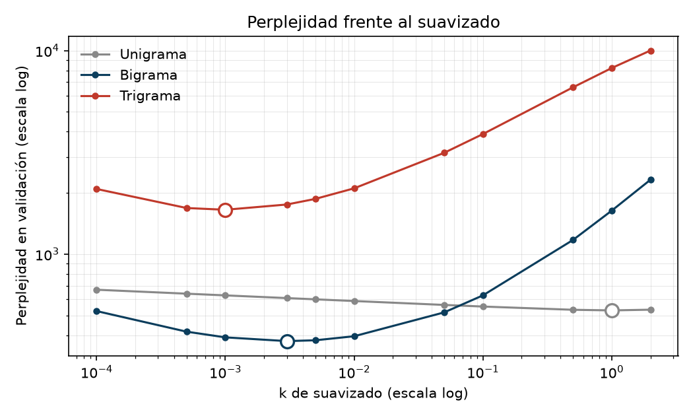

# Laboratorio #5 — Modelos de lenguaje

Natural Language Processing · Milton Beltrán

Este laboratorio construye tres **modelos de lenguaje n-grama** —unigrama, bigrama y trigrama—
implementados desde cero sobre el texto de *Don Quijote de la Mancha*, y los evalúa con perplejidad
y con una aplicación de autocompletado. El código completo está en `lab5.ipynb`.

<strong>Corpus de trabajo:</strong> 10,572 oraciones · 444,836 tokens ·
particiones 8,457 / 1,057 / 1,058 · vocabulario de 20,497 tipos estimado solo con entrenamiento

A diferencia de los labs #1 a #4 cambia el corpus y el objetivo: ya no se clasifica un documento sino
que se predice la siguiente palabra. Eso **invierte el pipeline**. Las *stopwords* se conservan
—son las que más predice un modelo de lenguaje—, no hay stemming porque se predice la palabra de
superficie, el orden pasa de irrelevante a ser el dato, la unidad deja de ser el documento y pasa a
ser la oración con sus tokens `<s>` y `</s>`, y la partición es aleatoria porque no hay etiquetas que
estratificar. Los modelos se implementan con `defaultdict`, sin `nltk.lm` ni `kenlm`.

## 1. Preparación del corpus

El archivo de Kaggle no es texto plano del Quijote: es el **ebook #2000 de Project Gutenberg**, con
19 líneas de cabecera y 360 de licencia en inglés. Se recorta por los marcadores `*** START ***` y
`*** END ***`, pero eso no basta —el crédito del transcriptor queda dentro de la región delimitada—,
así que se corta además por anclas del propio libro, de la portadilla a la palabra `Fin`. Viene
también con BOM, que `utf-8-sig` consume.

El detalle con más consecuencias es que el texto tiene ***wrap* duro a ~76 columnas**: el salto de
línea es tipográfico, no sintáctico, y una oración cruza varias líneas físicas. Sentenizar línea por
línea partiría casi todas las oraciones a la mitad, con fronteras `<s>` falsas. Los párrafos se
reconstruyen uniendo con espacio las líneas separadas por líneas en blanco, y solo entonces se aplica
`sent_tokenize(..., language="spanish")`.

Se eliminan los **126 encabezados de capítulo** y las 5 divisiones de parte, no por volumen —eran el
0.5 %— sino porque Punkt los parte en dos oraciones malformadas: `Capítulo primero.`, de dos palabras,
y un fragmento sin verbo principal. Cada una recibiría sus propios `<s>` y `</s>`, contaminando justo
las transiciones de inicio y fin. Los preliminares (tasa, privilegio, prólogo, versos) sí se conservan.

Hicieron falta **dos arreglos de tokenización**: `word_tokenize` está pensado para el inglés y deja
pegadas la raya de diálogo (`-porque`) y la apertura de interrogación (`¿cómo`). El Quijote es casi
todo diálogo —7,032 rayas, 959 `¿`— así que una palabra frecuente entraba al vocabulario hasta tres
veces. Son **1,299 tipos espurios**; corregirlo baja el vocabulario de 23,947 a 22,873. Es dispersión
artificial, y de la peor clase, porque el suavizado gastaría masa tapando un error de herramienta.
Todo se pasa a minúsculas y la puntuación se conserva como token.

**Palabras nunca vistas y dispersión.** El vocabulario de entrenamiento es de 20,497 tipos sobre
373,242 tokens. En prueba, el **2.82 %** de los tokens es desconocido; medido sobre palabras distintas,
el **19.60 %**. La brecha dice que lo desconocido es casi todo raro, y lo explica que **10,277 de las
20,497 palabras (50.1 %) aparecen una sola vez** en entrenamiento. Aun así, el **53.3 %** de las
oraciones de prueba contiene al menos un OOV.

Pero un modelo n-grama no necesita conocer la palabra sino la **secuencia**, y ahí la dispersión es
mucho peor:

| n | n-gramas de validación no vistos en entrenamiento | % |
|---|---|---|
| 1 (palabras) | 1,243 / 45,780 | 2.7 % |
| 2 (bigramas) | 10,969 / 44,723 | 24.5 % |
| 3 (trigramas) | 26,287 / 43,666 | **60.2 %** |

Con 20 mil palabras hay 4 × 108 bigramas y 8 × 1012 trigramas posibles contra 373 mil tokens: la
tabla está casi vacía y ningún corpus razonable la llenaría. Esta tabla justifica el resto del
laboratorio.

## 2. Modelos n-grama

Un solo `ModeloNGrama(n)` con dos `defaultdict`: `conteo` guarda el n-grama y `contexto` sus n−1
primeras palabras, que es el denominador. El `<s>` se replica n−1 veces y el unigrama lo descarta,
de modo que **los tres modelos predicen exactamente los mismos tokens** (44,723 en validación) y sus
perplejidades son comparables.

Lo que aporta el contexto se ve en una palabra: `quijote` ocupa el 0.47 % del corpus, tras `don`
sube a **0.8202** y tras `respondió don` a **0.9507**. Para la oración de validación
`- y yo lo digo también - respondió don quijote - .`, con 13 tokens predichos:

| Modelo | log P | P |
|---|---|---|
| Unigrama | −65.179 | 4.93 × 10−29 |
| Bigrama | −38.270 | 2.40 × 10−17 |
| Trigrama | −inf | **0** |

El bigrama da doce órdenes de magnitud más probabilidad que el unigrama. El trigrama no da un número
peor: **no da número**, y la culpa es de **un solo** trigrama de los trece, `lo digo también`. Los
otros doce sí están, y `respondió don quijote` aparece 212 veces sobre 223. Un cero anula el producto
entero.

Todo se calcula en logaritmos por necesidad, no por elegancia: la oración más larga de entrenamiento
tiene 329 palabras y su log P bajo el unigrama es −2,050.5, pero el producto directo devuelve **0.0**,
porque el menor float positivo es 5 × 10−324. Sin logaritmos el modelo declararía imposible una
oración de su propio corpus.

## 3. Suavizado

Con Laplace y add-k (k = 1, 0.1, 0.01, 0.001), sobre las dos oraciones anteriores:

| k | Oración sin ceros | Oración con un bigrama de cuenta 0 |
|---|---|---|
| 0 (sin) | −38.270 | **−inf** |
| 1 (Laplace) | −67.291 | −75.672 |
| 0.1 | −48.376 | −66.250 |
| 0.01 | −40.345 | **−62.945** |
| 0.001 | −38.528 | −65.049 |

El problema que resuelve es **el cero absorbente**: con el 24.5 % de bigramas de validación sin ver,
sin suavizado el modelo no puntúa mal, simplemente no puntúa. Pero el efecto **no es monótono**: un k
grande castiga los bigramas que sí estaban y uno muy pequeño deja al ausente con una probabilidad
tan diminuta que hunde la suma. La curva es en U con óptimo cerca de 0.01.

**Por qué le quita probabilidad a los frecuentes.** Porque no hay de dónde más sacarla: P(·|don) debe
sumar 1 sobre las 20,496 palabras, así que dar a las que nunca siguieron a `don` obliga a quitar a las
que sí. Sumar k engorda el denominador en k·|V|, y con |V| = 20,496 ese término aplasta al numerador.
`P(quijote|don)` cae de 0.8202 a **0.07525** con Laplace, y el **90.6 %** de la masa tras `don` va a
palabras que jamás lo siguieron. Con contextos raros es peor: tras `vuesa` (174 apariciones, 6
continuaciones) Laplace regala el **99.1 %**. La distribución sigue sumando exactamente 1: el
suavizado redistribuye, no inventa.

Ahí está la relación con la **sobreconfianza**. Sin suavizar el modelo afirma dos cosas demasiado
tajantes: que `quijote` sigue a `don` el 82 % de las veces y que todo lo que no vio es imposible. Las
dos salen de tratar la falta de datos como evidencia. El problema de Laplace es pasarse de humilde y
destruir estimaciones buenas. Con k = 0.001 el trigrama pasa de −inf a **−37.731**, mejor que el
bigrama sin suavizar: el contexto largo servía, solo le faltaba no declarar imposible lo no visto.

## 4. Perplejidad

Cada modelo tiene su propio óptimo de k, y **se corre a la izquierda conforme sube n** (1 → 0.003 →
0.001): cuantos más ceros tiene la tabla, más caro sale repartir masa a ciegas. Elegido el modelo solo
con validación, la medición final sobre prueba —primera y única vez que se toca:

| Modelo | mejor k | PPL validación | PPL prueba |
|---|---|---|---|
| Unigrama | 1 | 529.1 | 550.6 |
| **Bigrama** | **0.003** | **373.8** | **397.0** |
| Trigrama | 0.001 | 1,652.1 | 1,695.0 |

**Perplejidad final: 397.00.** Los 23 puntos sobre validación son la parte del ajuste de k que no
generaliza. Al aumentar k la perplejidad **sube**, y mucho: en el bigrama, de k = 0.003 a k = 1 se
multiplica por más de cuatro (373.8 → 1,635.3), por la misma razón de la sección 3. Bajarlo de más
tampoco es gratis: los n-gramas no vistos y las palabras OOV reciben una probabilidad tan cercana a
cero que arrastran la suma de logaritmos.

## 5. Autocompletado y generación

Con el bigrama y k = 0.003, sobre seis fragmentos de oraciones reales de prueba, la palabra que de
verdad seguía aparece en el top-5 en **tres de los seis**:

| Fragmento | Real | Top-5 |
|---|---|---|
| `pues , con todo` | `eso` | lo, el, esto, **eso**, `,` |
| `- virtud es -` | `respondió` | `,`, dijo, **respondió**, no, ¡ |
| `así que , somos ministros` | `de` | **de**, `,`, infernales |
| `luego subió don quijote` | `sobre` | `-`, `,`, de, `.`, y |
| `y , en` | `diciendo` | el, la, su, las, los |
| `de allí a` | `poco` | la, su, los, lo, don |

Los fallos no son absurdos: tras `en` el modelo propone artículos, que es lo correcto casi siempre,
solo que aquí venía un gerundio. Es el techo de un contexto de una palabra, no un error. Se ve mejor
con `en un lugar de la`: el modelo solo mira `la` y sugiere `cabeza, duquesa, mano, mancha` —acierta
en cuarto lugar y por casualidad—. La frase más famosa del español no le sirve porque no la puede ver.
Con `ministros` solo vio **tres** continuaciones en todo el corpus y no puede ofrecer cinco.

**El estilo del siglo XVII** se cuela en todo. Lo más probable tras `quijote` es la **raya de diálogo**
(0.251), porque el libro es casi todo conversación con la convención tipográfica de la época. Salen
`vuesa merced`, `dél`, `desta`, `socarrón`, `malambruno`, y fórmulas enteras como
`- dijo sancho panza .`. Un autocompletado entrenado con esto sería inservible para escribir español
actual: predice muy bien el de Cervantes, que es lo que se le pidió.

Generando oraciones con cada modelo, el unigrama produce palabras sueltas sin sintaxis; el bigrama
arma tramos legibles que se pierden; el trigrama llega a
`- par dios que así acomete mi señor , nos deshizo este pensamiento`, que pasa por Cervantes.

## 6. Análisis

**1. Por qué la regla de la cadena, siendo exacta, no sirve.** No falla la fórmula sino estimar sus
factores: pide condicionar cada palabra a **toda** su historia, y esa historia es única. Para estimar
por conteo `P(quijote | - y yo lo digo también - respondió don)` haría falta haber visto ese prefijo
varias veces, y aparece cero. Los números de la sección 1 dan la escala: si con el 50.1 % del
vocabulario visto una sola vez el 53.3 % de las oraciones de prueba ya trae una palabra desconocida,
el prefijo entero no tiene ninguna posibilidad. Y escala rápido: 2.7 % de palabras no vistas se
vuelve 24.5 % en bigramas y 60.2 % en trigramas; con diez palabras de contexto sería casi el 100 %.
El supuesto de Markov es lo que la vuelve estimable, a cambio de olvidar.

**2. El compromiso entre contexto y dispersión.** En perplejidad se confirma limpiamente: 550.6 →
**397.0** → 1,695.0 sobre prueba. La primera palabra de contexto mejora un 28 %; la segunda empeora
tres veces, hasta quedar **peor que no usar contexto**. En generación pasa lo contrario y el trigrama
es el mejor. La contradicción se resuelve midiendo cuánto copia: la secuencia literal más larga
compartida con entrenamiento pasa de 3 palabras en el unigrama a 5 en el bigrama y **7** en el
trigrama (`vuestra merced tan duro de celebro ,`). El trigrama no escribe mejor: **recita**. Al
generar solo elige entre continuaciones observadas, así que la dispersión no le estorba; al evaluar
texto nuevo lo hunde. Que un texto suene bien no dice que el modelo generalice.

**3. El efecto del suavizado.** Sobre la perplejidad es lo que la hace existir, pero con un óptimo
estrecho: k = 0.003 da 373.8 y Laplace 1,635.3. Sobre el texto generado el efecto es el **contrario**.
Muestreando del vocabulario completo, con k = 0.003 cerca de la mitad de los tokens sale de la masa de
suavizado y el resultado ya es ilegible; con k = 1 pasa del 95 % y queda ruido puro
(`ahogó salteó puesto cucharada hallasen`). Es una espiral: al muestrear una palabra rara el contexto
siguiente también lo es, y en un contexto raro el suavizado se lleva casi toda la masa. Evaluar paga
un poco de probabilidad; muestrear paga el vocabulario entero.

Hace falta aunque el corpus sea grande porque el problema no es de tamaño sino de forma: el
vocabulario crece con el corpus, así que |V|2 crece más rápido que el número de tokens y la tabla
nunca se llena. La ley de Zipf lo garantiza —aquí la mitad del vocabulario aparece una sola vez— y
siempre quedará una cola de n-gramas legítimos con cuenta cero. Más datos mueven el problema, no lo
eliminan.

**4. Qué n elegiría en producción: n = 2.**

| n | Memoria | µs/consulta | Contexto conocido en prueba | PPL prueba |
|---|---|---|---|---|
| 1 | 0.29 MB | ≈ 8,500 | 100.0 % | 550.6 |
| **2** | **2.41 MB** | **≈ 200** | **97.1 %** | **397.0** |
| 3 | 7.20 MB | ≈ 26 | 75.0 % | 1,695.0 |

En calidad no hay discusión y en memoria 2.41 MB no es nada para un servicio real. La velocidad sale
**invertida**: el unigrama es el más lento porque tiene un único contexto con 20,496 continuaciones
que ordenar en cada consulta, y el trigrama el más rápido porque cada contexto tiene poquísimas. Pero
la columna que decide es la última que uno esperaría: el trigrama **solo conoce el contexto en el
75 %** de las posiciones de prueba, o sea que una de cada cuatro pulsaciones no daría ninguna
sugerencia, mientras el bigrama cubre el 97.1 %. Es rápido porque no sabe nada, y en autocompletado
no responder es peor que responder regular.

Con más datos la respuesta cambiaría, y en producción se usaría además un modelo **interpolado** que
retroceda a bigrama cuando el trigrama no conozca el contexto. Con estos 373 mil tokens, n = 2.

---

<strong>Repositorio:</strong> <a href="https://github.com/MrCifristo/NaturalLanguageProcessing">github.com/MrCifristo/NaturalLanguageProcessing</a> · Notebook: <code>lab5-nlp/lab5.ipynb</code>

